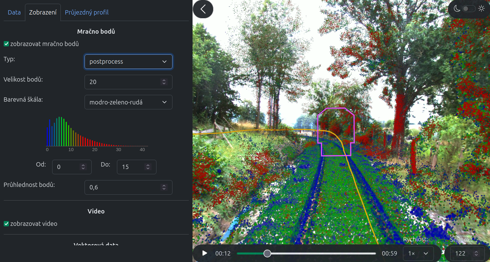

# Visualization of Lidar, Camera, and Vector Data from a Railway Mobile Mapping System

<p align="center">
    
</p>


## Table of Contents

- [About the Project](#about-the-project)
- [Installation](#installation)
- [Directory Structure](#directory-structure)
- [Displaying a Larger Dataset](#displaying-a-larger-dataset)
- [Building the Documentation](#building-the-documentation)
- [Built With](#built-with)
- [Contact](#contact)

## About the Project

A web app which visualizes data from a mobile mapping system. The data files can be uploaded manually, or, if the application runs locally, using a special project file with specified paths to data files.

The app is built mainly in Python, but also contains a script in JavaScript which runs on the client side to optimize performance.

An **incomplete** demo runs at [http://anabaptists.sci.muni.cz:8000/](http://anabaptists.sci.muni.cz:8000/)

In the demo, which only contains "raw" data from the mobile mapping system, the point cloud data is not aligned completely with the video. Example workspace settings which fix the alignment are in the file **workspace.toml**. In the application, go to tab *Zobrazení*, scroll to the bottom, click on *Importovat nastavení zobrazení* and upload file **workspace.toml** (or fix the alignment manually by the sliders in the *Zobrazení* tab).

## Installation

Commands to install the project (on Linux, the dependencies are **Python 3**, **pip** and **npm**):

```bash
# create a Python virtual environment and activate it
python3 -m venv .venv
source .venv/bin/activate
# install Python libraries
pip install -r requirements.txt
# install JavaScript libraries
cd scripts
npm install
cd ..
# bundle the JS script
npx webpack
```

Command to run to project:

```bash
# run the Python app (the virtual environment must be activated) 
python3 app.py
```

The application contains a short dataset (10 seconds record) by default. The app, like the live demo, 
displays "raw", unaligned data from the mobile mapping system. The alignment can be fixed in the way described in section [About the Project](#about-the-project).

## Directory Structure

```
xmiska03-Zobrazeni_dat_z_zeleznicniho_MMS/
├── app.py                     # the Python application
├── assets/                    # the default video and icon of the application
├── data/                      # data from a mobile mapping system + train profile shape
├── documentation/
│   ├── app/                   # documentation of the Python application
│   └── visualization_js/      # documentation of script visualization.js
├── Doxyfile                   # Doxygen configuration file
├── README.md
├── requirements.txt           # list of Python dependencies
├── scripts/
│   ├── package.json           # dependencies of script visualization.js (for npm)
│   └── visualization.js       # a script for rendering the visualization on the client side
├── webpack.config.js          # Webpack configuration for bundling script visualization.js
├── workspace.toml             # workspace settings which can be uploaded to the app
└── ...                        # 13 Python modules (*.py)
```

## Displaying a Larger Dataset

A larger dataset (1 minute record) is in the **data** directory (**MMS_dataset_1min**).

If the application runs on localhost, the project file included in the dataset can be used. Take the following steps:
- Open the directory **data/MMS_dataset_1min**.
- In the second line of the project file (**project.toml**), set variable **project_path** to the absolute path of the directory where the project file is located.
- In the app, go to tab *Data*, section *Projektový soubor*, click on *Vybrat soubor* and upload file **project.toml**.

## Building the Documentation

The documentation was built using **Doxygen** and **JSDoc**. To rebuild it, run the following commands:

```bash
# run Doxygen for the documentation of the app
doxygen
# run JSDoc for the documentation of the additional script
jsdoc scripts/visualization.js -d documentation/visualization_js
```

## Built With

- Python – the main language
- [Dash](https://dash.plotly.com/) – a framework for creating web apps in Python
- JavaScript - used for rendering the visualization on the client side
- [Deck.gl](https://deck.gl/) – a framework for data visualization in JavaScript

## Contact

Created by Zuzana Miškaňová

E-mail: [xmiska03@stud.fit.vutbr.cz](xmiska03@stud.fit.vutbr.cz)


